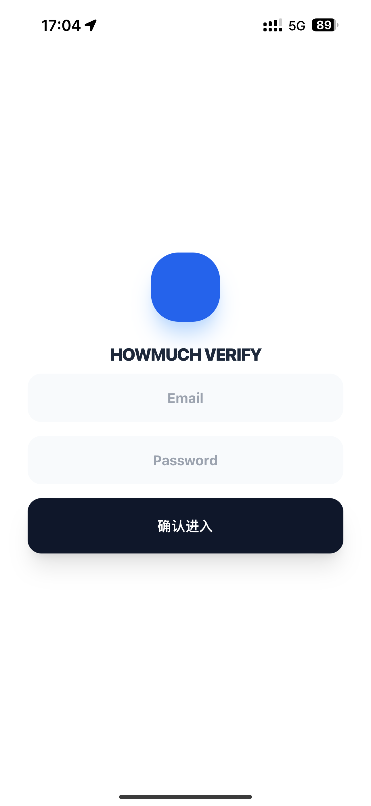
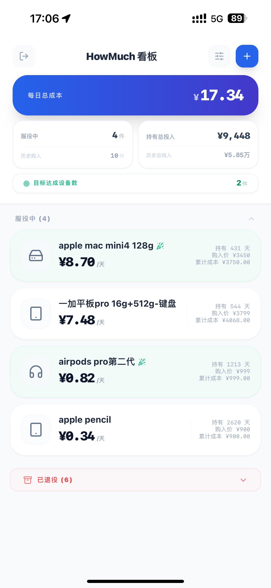
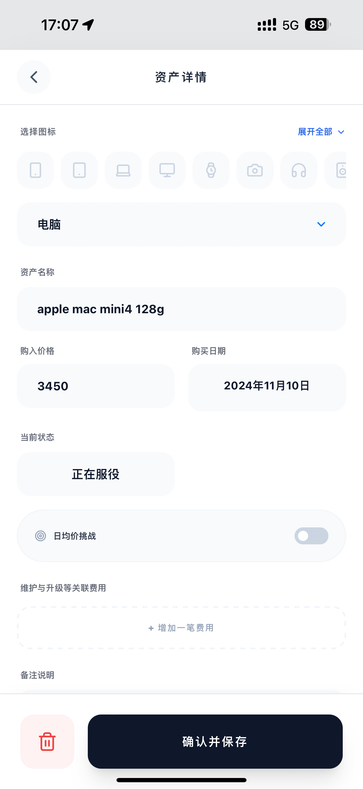
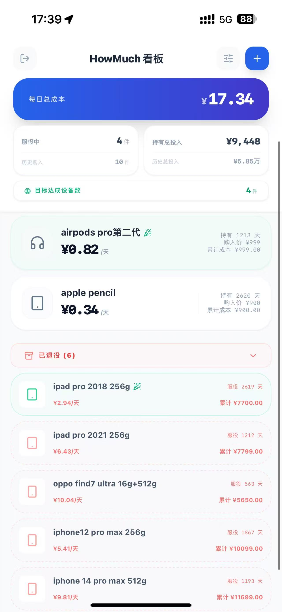

 HowMuch 资产看板 💰【安卓版本见Releases：howmuch beta】

**HowMuch** 是一款基于 PocketBase 和 Vue 3 开发的轻量化个人资产持有成本管理工具。它能帮你计算资产的“日均持有成本”，助你审视消费价值。

✨ 核心功能
* **日均成本看板**：实时计算每件资产从购入至今的每日平均费用。
* **日均价挑战**：设定目标日均价，达成目标时自动点亮勋章。
* **全生命周期管理**：支持记录维护费用、变现回收金额，精确计算净投入。
* **PWA 支持**：支持添加到手机主屏幕，具备类原生 App 的使用体验。
* **数据自主掌控**：支持 JSON 数据的导出与导入备份。

🛠️ 技术栈
* **前端**：Vue 3 (Composition API), Tailwind CSS。
* **后端**：[PocketBase](https://pocketbase.io/) (极简的开源后端方案)。
* **图标**：Lucide Icons。

### 界面预览

<p align="center">
  
  
</br>
  
  
</p>

🚀 快速部署 (以 Linux 为例)

1. 准备环境
```bash
mkdir howmuch && cd howmuch
# 下载并解压 PocketBase (请根据系统选择版本)
wget [https://github.com/pocketbase/pocketbase/releases/download/v0.22.21/pocketbase_0.22.21_linux_amd64.zip](https://github.com/pocketbase/pocketbase/releases/download/v0.22.21/pocketbase_0.22.21_linux_amd64.zip)
unzip pocketbase_0.22.21_linux_amd64.zip
```

2. 部署代码
* 建立静态网页目录：
```bash
mkdir -p /root/howmuch/pb_public
```
* 请将你的 index.html、manifest.json 和 icon.png 放入此目录。

3. 配置后台永久运行 (Systemd)
* 创建服务文件：
```bash
nano /etc/systemd/system/howmuch.service
```
* 写入以下配置（已显式指定数据目录以增强稳定性）：
```bash
[Unit]
Description=HowMuch Asset Management Service
After=network.target

[Service]
Type=simple
User=root
Group=root
WorkingDirectory=/root/howmuch
# 明确指向程序路径、监听端口及数据存放目录
ExecStart=/root/howmuch/pocketbase serve --http="0.0.0.0:9001" --dir=/root/howmuch/pb_data
Restart=always

[Install]
WantedBy=multi-user.target
```

4. 启动服务：
```bash
systemctl daemon-reload
systemctl enable --now howmuch
```

5. 开放防火墙端口：
```bash
# 放行 9001 端口
ufw allow 9001/tcp
```

6. 记得同步要放行云服务器的9001端口，新增防火墙规则


7. 初始化数据库
* 运行服务：./pocketbase serve --http="0.0.0.0:9001"。
* 访问后台：http://服务器IP:9001/_/ 创建管理员。
* 关键步骤：在 Settings -> Import collections 中，导入仓库里的 pb_schema.json 文件以恢复数据库结构。

📱 手机端使用
* 建议使用手机浏览器访问地址，并选择 “添加到主屏幕”，以获得最佳的全屏看板体验。


📄 开源协议
* 本项目遵循 MIT 协议开源。
